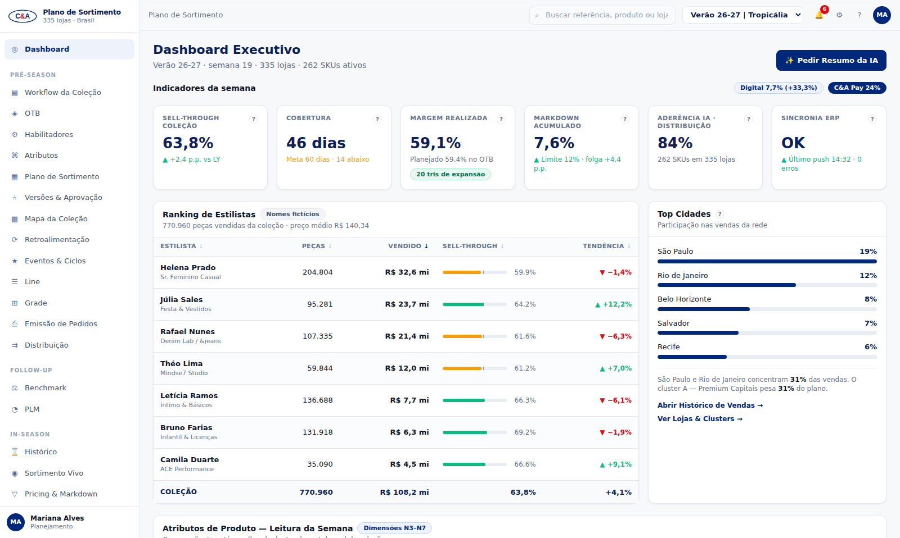
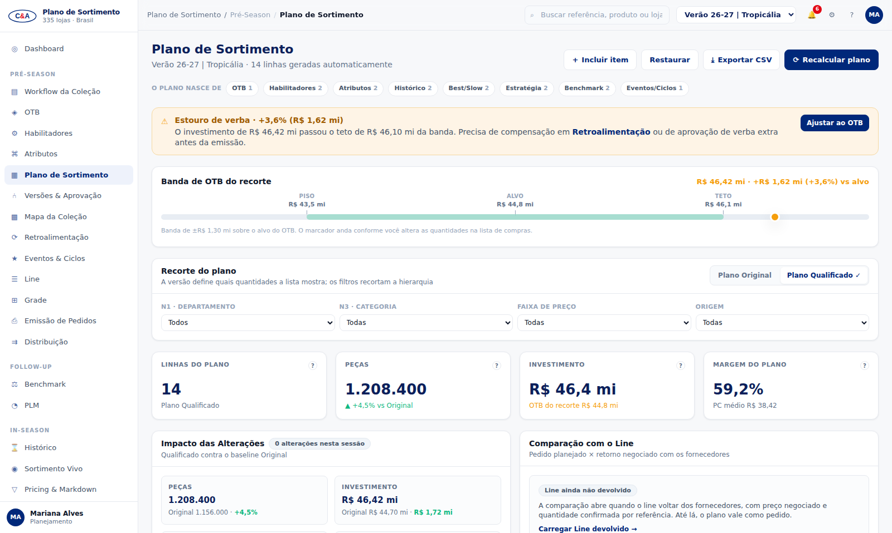
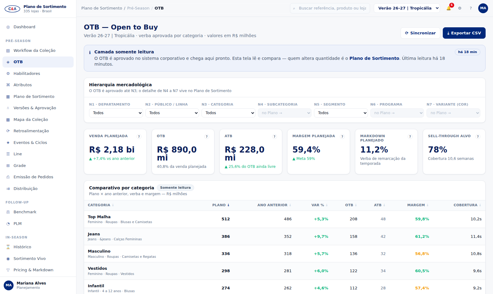
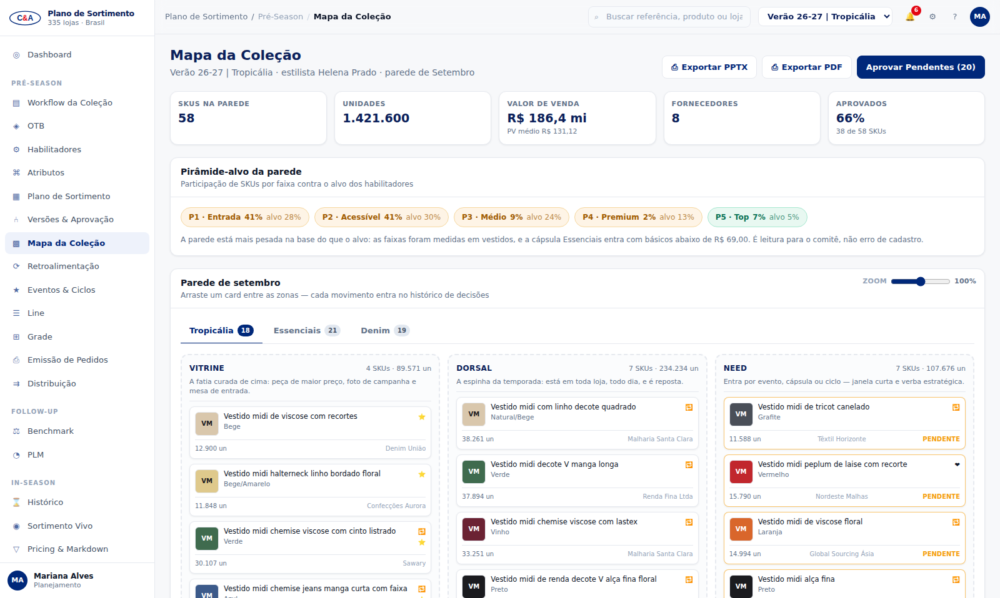
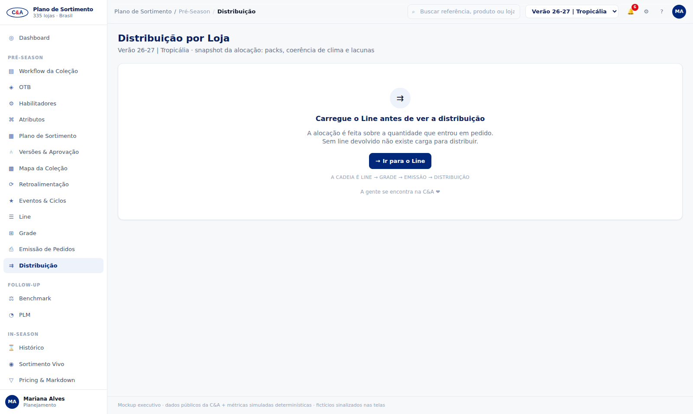
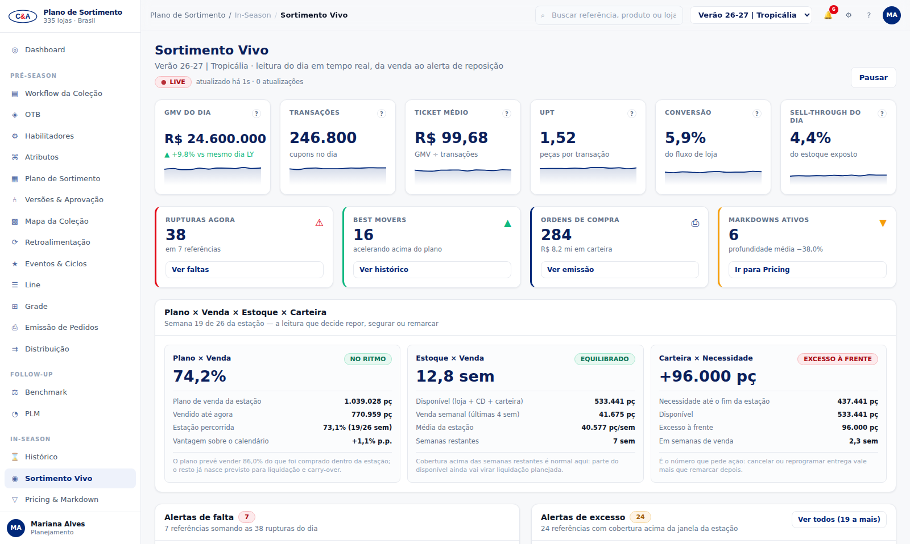
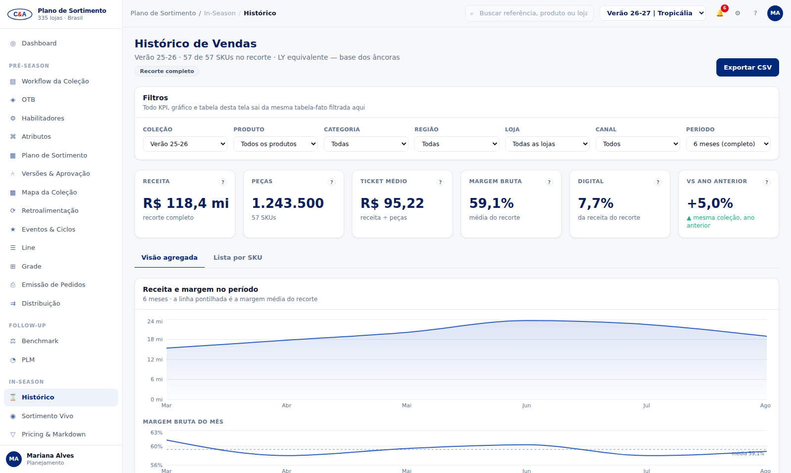
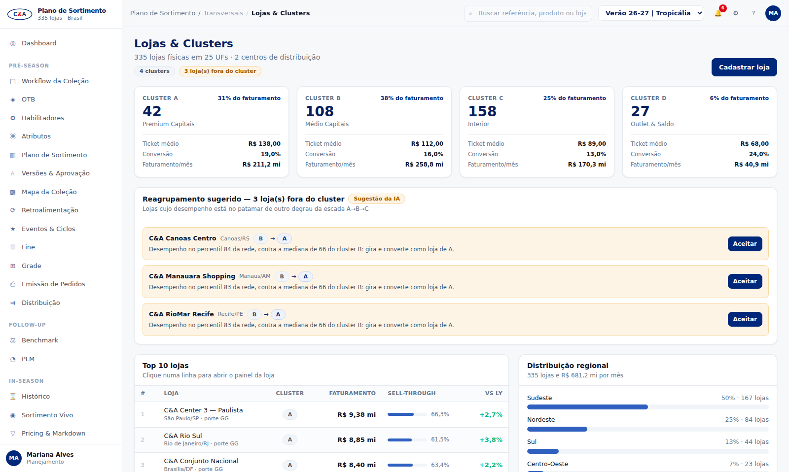

# Plano de Sortimento — C&A (mockup)

Mockup de alta fidelidade de uma plataforma de **planejamento de sortimento para varejo de moda**,
com identidade e dados da **C&A Brasil**. É uma casca navegável para demonstração executiva: sem
backend de negócio, mas com dados reais de catálogo/preços/indicadores públicos e um conector
opcional que hidrata fotos e preços ao vivo do site cea.com.br.

Referência funcional: 22 telas em 5 áreas (Dashboard Executivo · Pré-Season · Follow-up · In-Season
· Transversais). As regras do projeto estão em [`CLAUDE.md`](./CLAUDE.md) e a especificação por tela
em [`docs/PROMPTS_CLAUDE_CODE.md`](./docs/PROMPTS_CLAUDE_CODE.md) (fases 0–10).

## Como rodar

```bash
npm install
npm run dev      # Vite em :5173 + conector Express em :3001 (proxy /api)
```

| Script                | O que faz                                                        |
| --------------------- | ---------------------------------------------------------------- |
| `npm run dev`         | front (5173) + mini-backend (3001) via `concurrently`             |
| `npm run build`       | build de produção do front                                        |
| `npm run typecheck`   | `tsc --noEmit` — obrigatório antes de cada commit                 |
| `npm run lint`        | ESLint — obrigatório antes de cada commit                         |
| `npm run verificar`   | autoteste dos números-âncora — ~293 verificações, sai com erro se algum não fechar |
| `npm run qa`          | varredura do código atrás do que as regras de ouro proíbem        |
| `npm run fotos`       | baixa as fotos reais do catálogo C&A e gera o manifesto (ver abaixo) |
| `npm run build:pagina`| empacota o app num HTML único, sem requisição externa             |

## Telas

| Dashboard Executivo | Plano de Sortimento |
| --- | --- |
|  |  |

| OTB | Mapa da Coleção |
| --- | --- |
|  |  |

| Distribuição por Loja | Sortimento Vivo |
| --- | --- |
|  |  |

| Histórico de Vendas | Lojas & Clusters |
| --- | --- |
|  |  |

As 21 rotas: `/` · `/workflow` · `/otb` · `/habilitadores` · `/atributos` · `/plano` · `/versoes` ·
`/mapa` · `/retroalimentacao` · `/eventos` · `/line` · `/grade` · `/emissao` · `/distribuicao` ·
`/benchmark` · `/plm` · `/historico` · `/vivo` · `/pricing` · `/lojas` · `/cadastro`.

## Stack

React 18 · Vite · TypeScript · Tailwind CSS · React Router · Recharts · Express (conector VTEX).

## Estrutura

```
src/
  app/            # uma pasta por tela (21 rotas) + routes.ts (registro único)
  components/ui/  # KpiCard, StatusChip, Banner, SectionCard, DataTable,
                  # EmptyGate, Sparkline, PageHeader, Tooltip, Button, Toast
  components/layout/  # AppShell, Sidebar, Topbar, LogoCea
  data/cea_data.json  # FONTE ÚNICA de dados reais (não editar valores)
  data/derived.ts     # números-âncora + geradores simulados (seed fixo 2627)
  lib/cea.ts          # loader do snapshot, hydrate(cod), placeholderFor()
  lib/format.ts       # formatBRL, formatPct, formatCompact...
  styles/tokens.css   # design tokens (cores, radius, sombras)
server/index.ts       # conector VTEX (/api/cea/search, /ref/:cod, /logo)
scripts/              # autoteste dos âncoras
docs/                 # blueprint, prompts e capturas de referência
```

## Dados

- **Reais (fonte pública):** catálogo, preços, remarcações, árvore mercadológica, marcas e
  indicadores financeiros da C&A Modas S.A. (release 2T26 e FY25).
- **Simuladas:** métricas por loja/SKU (venda, estoque, sell-through, cobertura), geradas em
  `derived.ts` com seed fixo — idênticas em todo reload e entre telas.
- **Fictícios:** estilistas, fornecedores e a planner Mariana Alves.

## Conector VTEX (opcional)

O mini-backend em `server/index.ts` faz proxy do catálogo público para evitar CORS:

| Rota                          | Upstream                                              |
| ----------------------------- | ----------------------------------------------------- |
| `GET /api/cea/search?term=`   | busca por termo no catálogo                            |
| `GET /api/cea/ref/:cod`       | busca por RefId (código do produto)                    |
| `GET /api/cea/logo`           | extrai o azul e o vermelho oficiais do logo            |

Timeout de 3s, cache em memória de 1h e `{ fallback: true }` em qualquer erro — **a demo funciona
perfeitamente offline do conector**, caindo no snapshot local.

## Fotos dos produtos

As imagens são **fotos públicas do catálogo do cea.com.br**, baixadas uma vez e commitadas em
`public/produtos/` — a demo serve tudo local e não faz nenhuma requisição de rede para exibir
produto. São 54 produtos com foto (500px para card e 160px para thumb) e o manifesto em
`src/data/fotos.json`.

O `ProductImage` resolve em dois níveis: **foto local** → **silhueta SVG**. A silhueta é o desenho
da peça por categoria (vestido, camiseta, camisa, calça, bermuda, legging, sutiã, top, camiseta
infantil) preenchido com a cor real da variante, e cobre tanto os produtos sem foto quanto o caso
de a imagem falhar ao carregar. As fotos são JPG de estúdio com fundo branco, então entram com
`object-contain` sobre moldura branca e `aspect-ratio` fixo: a peça aparece inteira, sem corte nem
layout shift.

**Foto de referência.** Em 39 das 54 entradas o manifesto traz `nomeReal`, `link` e `marca` como
lista, porque a coleta caiu na busca por termo e o catálogo devolveu vários candidatos. Comparando
imagem por imagem, a foto baixada é sempre a do **primeiro** candidato — que costuma ser outra peça
da mesma família, não o SKU do snapshot (o vestido de linho natural veio com a foto da versão
floral azul; a camiseta UV "coqueiro", com a do Homem-Aranha). Nesses casos a tela marca a imagem
como *foto de referência* e o `title` diz o que ela mostra de fato, em vez de deixar o card afirmar
uma cor que a foto contradiz. Onde a coleta achou um resultado só, o nome do catálogo aparece na
ficha do PLM.

**Preço nunca vem daqui.** O `fotos.json` traz preço coletado, e ele diverge do snapshot em vários
itens (a camiseta 1049412 aparece como R$ 49,99 contra os R$ 29,99 reais do catálogo). A fonte da
verdade continua sendo o `cea_data.json`; do manifesto a tela usa só imagem, nome real e marca.

Para recoletar (precisa de acesso ao cea.com.br):

```bash
npm run fotos            # baixa o que falta e atualiza o manifesto
npm run fotos -- --forcar # rebaixa tudo
```

## Como os números se sustentam

Nenhum número aparece escrito dentro de um componente. Tudo sai de `cea_data.json` (real) ou de
`derived.ts` (derivado, com seed fixo 2627), e os dois scripts abaixo são o que impede a demo de
sair do lugar:

- **`npm run verificar`** — confere os números-âncora do `CLAUDE.md` um a um e ainda testa as
  identidades entre eles: a frota de 335 lojas fechando por cluster e por região, o plano de
  R$ 46,4 mi contra o OTB, os 7.912 packs e 38.640 peças da distribuição saindo da mesma alocação,
  a cadeia inteira do painel do Sortimento Vivo, os 102 dias até a Black Friday. Falhou um, o
  script sai com erro.
- **`npm run qa`** — varre o código atrás de lorem ipsum, do rosa da concorrência e de número de
  negócio digitado à mão dentro de tela.

Quando um âncora do `CLAUDE.md` não fechava com outro, a decisão está comentada no ponto exato do
`derived.ts` — procure por "âncora" no arquivo.

## Identidade

O logo é o **wordmark oficial de 2011** — moldura ondulada vermelha, miolo branco e "C&A" em azul.
O arquivo de origem está em [`docs/marca/C-und-A-Logo-2011.svg`](docs/marca/C-und-A-Logo-2011.svg)
e os traçados foram embutidos em `src/components/layout/LogoCea.tsx`, para o logo funcionar igual no
dev, no build e no arquivo único publicado, sem nenhuma requisição. O mesmo desenho serve de favicon.

Duas notas sobre cor, porque as fontes divergem:

- No logo real o **"&" é azul**, não vermelho; o vermelho é o da moldura. A descrição
  "azul institucional + & vermelho" do `CLAUDE.md` se referia à moldura.
- O logo traz azul `#002e5c` e vermelho `#9d0822` (exportados como `CORES_LOGO` em `lib/cea.ts`).
  A interface segue com os tokens do `CLAUDE.md` — `--cea-blue #00287A` e `--cea-red #E30613` —,
  então o logo usa as cores dele e a interface as dela. Alinhar as duas paletas é uma decisão de
  marca, não de código: basta trocar os dois valores em `src/styles/tokens.css`.

Tipografia Poppins (títulos) + Inter (dados). Tokens em `src/styles/tokens.css`.
